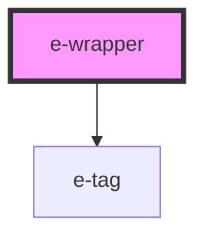

# e-wrapper

<!-- Auto Generated Below -->

## Properties

| Property | Attribute | Description | Type     | Default     |
| -------- | --------- | ----------- | -------- | ----------- |
| `apikey` | `apikey`  |             | `string` | `undefined` |
| `tags`   | --        |             | `[]`     | `undefined` |

## Dependencies

### Depends on

- [e-tag](../e-tag)

### Graph

----------------------------------------------

*Built with [StencilJS](https://stenciljs.com/)*
