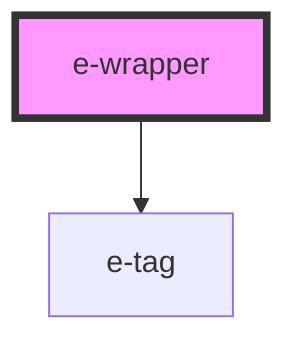

# e-wrapper

<!-- Auto Generated Below -->

## Properties

| Property      | Attribute | Description | Type          | Default     |
| ------------- | --------- | ----------- | ------------- | ----------- |
| `apikey`      | `apikey`  |             | `string`      | `undefined` |
| `tags`        | --        |             | `string[]`    | `[]`        |
| `videoPlayer` | --        |             | `HTMLElement` | `undefined` |

## Events

| Event      | Description | Type               |
| ---------- | ----------- | ------------------ |
| `showTags` |             | `CustomEvent<any>` |

## Methods

### `showTag(e: any) => Promise<void>`

#### Returns

Type: `Promise<void>`

## Dependencies

### Depends on

- [e-tag](../e-tag)

### Graph

----------------------------------------------

*Built with [StencilJS](https://stenciljs.com/)*
